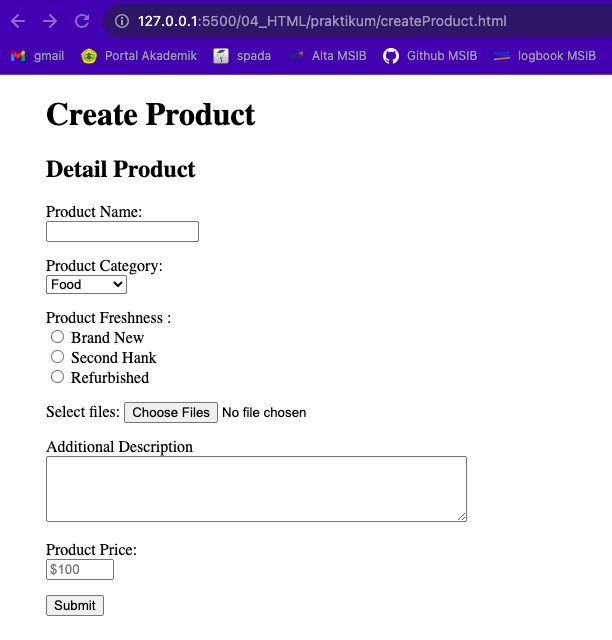

# Summary

### Frontend vs Backend

*Front-End Web Developer* bertanggung jawab langsung terhadap pengguna (_end-user_) sehingga ia harus membuat website tampak indah dan memiliki experience yang baik pengguna. Sedangkan *Back-End Web Developer* bertanggung jawab untuk mengelola sumber daya (resources) atau data yang dibutuhkan oleh *Front-End* sebelum tampak di hadapan pengguna.

Tools yang digunakan Frontend Developer:

1. HTML
   HTML adalah sebuah struktur dasar yang mendefinisikan struktur dan konten halaman web. HTML menggunakan tag untuk mendeskripsikan berbagai elemen pada halaman web, seperti judul, paragraf, tautan, gambar, formulir, dan lainnya.

2. CSS
   CSS digunakan untuk mengontrol presentasi dan gaya elemen HTML yang memisahkan konten (HTML) dari representasi visualnya.Aturan CSS menentukan bagaimana elemen harus muncul, termasuk properti seperti warna, font, spasi, dan tata letak.

3. Javascript
   JavaScript adalah bahasa pemrograman dinamis yang digunakan untuk membuat web interaktif. Contoh penggunaannya seperti slider, form validation, animation, dll.

### Kegunaan HTML

- membuat struktur dan isi dari halaman website
- membuat form HTML
- mempublikasikan halaman website secara online

### Tag style dalam HTML

- <strong> & <b> : bold text
- <em> : italic text
- <s> : strikethrough
- <u> : underlined
- <br> : new line
- target=”\_blank” : akan membuka link di tab baru

---

# Latihan

### Soal Prioritas

> Membuat halaman web dengan nama createProduct.html



> Membuat landing page dengan nama landingPage.html

I converted the html to be png file on this [site](https://cloudconvert.com/html-to-png)


### Soal Eksplorasi

> Lakukan validasi “required” pada setiap form yang telah dibuat :check_mark_button:

```
e.g.
<div class="mb">
        <label for="myfile">Select files:</label>
        <input type="file" id="myfile" name="myfile" multiple required />
      </div>
```

> form product Product Name mempunyai minimal 6 huruf dan maksimal 50 huruf :check_mark_button:

```
<label>Product Name:</label> <br />
        <input
          type="text"
          id="name"
          name="name"
          minlength="6"
          maxlength="50"
          required
        />
```

> Product Price harus berupa angka :check_mark_button:

```
<input
          type="number"
          id="price"
          name="price"
          placeholder="$100"
          style="width: 60px"
          required
        />
```

> Sambungkan halaman landingPage.html dengan CreateAccount.html sehingga dapat berpindah halaman :check_mark_button:

button `Get Started` pada landing page jika di klik akan mengarahkan user ke halaman form.
