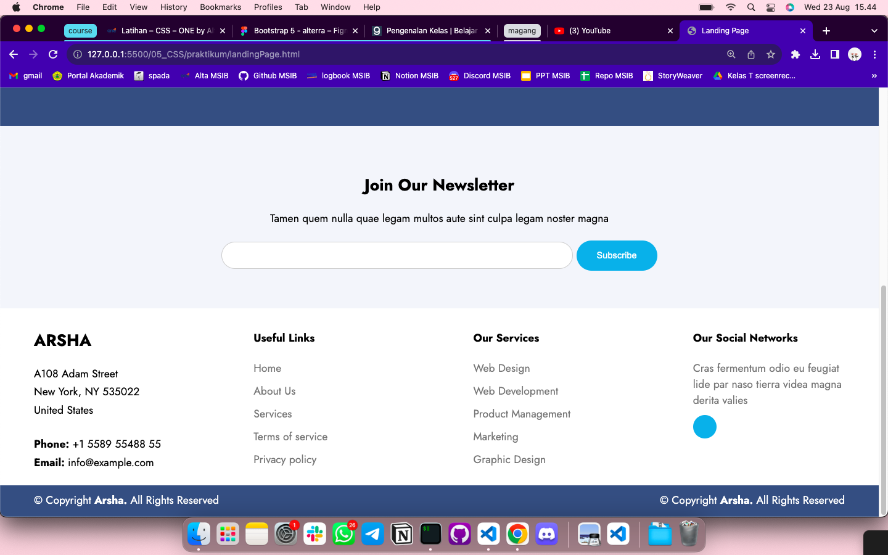

# Summary

### Definisi CSS

CSS (Cascading Style Sheets) adalah bahasa pemrograman yang digunakan untuk mengendalikan tampilan dan format suatu dokumen HTML. Dengan CSS, kita dapat mengatur elemen-elemen HTML seperti teks, gambar, warna latar belakang, dan tata letak halaman web.

### Cara menggunakan CSS

1. Extenal CSS <br>
   Membuat file tersendiri di luar file html, misalnya style.css dan dihubungkan ke file html melalui link

2. Internal CSS <br>
   Menambahkan CSS pada tag `style` di dalam tag head atau body.

3. Inline CSS <br>
   CSS inline adalah sebuah kode CSS yang kita sematkan pada element menggunakan atribut `style`. Contoh:

   ```html
   <button style="color: blue; border: 1px solid gray">Lihat</button>
   ```

   ### Bootstrap

   Framework adalah sekumpulan code yang dapat digunakan langsung untuk mempermudah proses pembangunan website. Bootstrap merupakan salah satu framework CSS yang paling banyak digunakan karena cepat, gratis, responsif, dan mudah digunakan.

   Di dalam bootstrap kita dapat memanfaatkan berbagai component, contohnya:

   - Grid
   - Form
   - Card
   - Accordion
   - Carousel, dll.

---

# Latihan

## Soal Prioritas

### 1. Membuat halaman landingPage.html




### 2. Mengimplementasikan beberapa point berikut

> Mengimplementasikan hover pada button dan list footer :white_check_mark:
> Mengimplementasikan CSS External dan selection class :white_check_mark:
> Mengimplementasikan selector dengan id, class dan tag :white_check_mark:

## Soal Eksplorasi

> 1. Membuat halaman menjadi responsive untuk halaman LandingPage.html dengan media query pure CSS. :white_check_mark:
> 2. Membuat efek transisi warna background pada section subscribe :white_check_mark:

```
#subscribe {
  background-color: #f3f5fa;
  animation: changeBackgroundColor 10s infinite;
}

@keyframes changeBackgroundColor {
  0% {
    background-color: azure;
  }
  25% {
    background-color: lavenderblush;
  }
  50% {
    background-color: lavender;
  }
  75% {
    background-color: mistyrose;
  }
  100% {
    background-color: #f3f5fa;
  }
}
```
