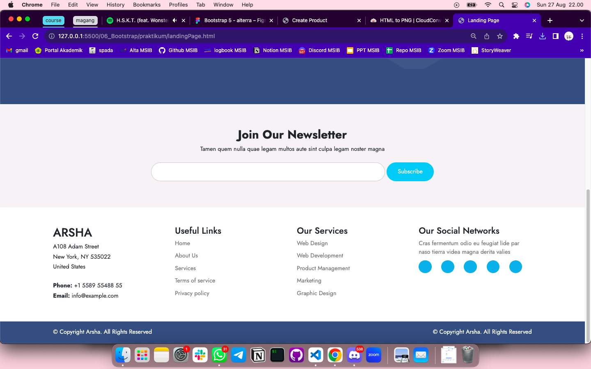
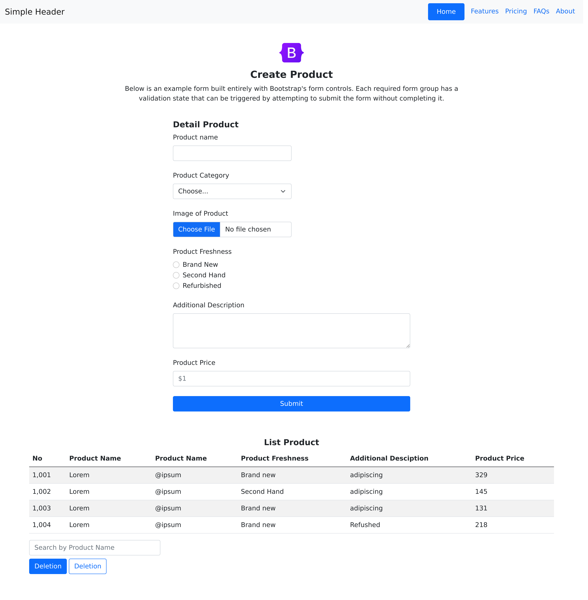
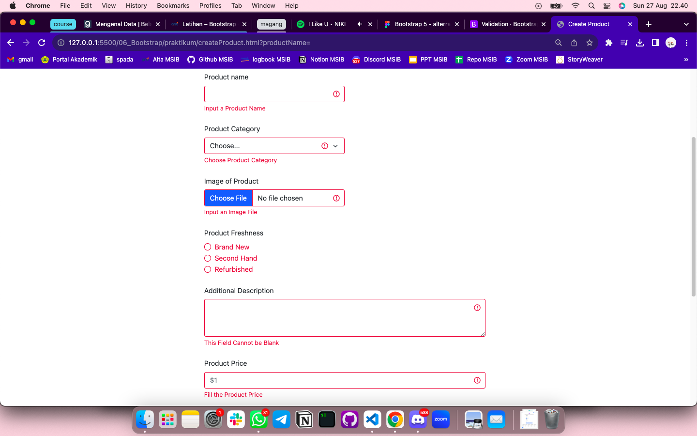
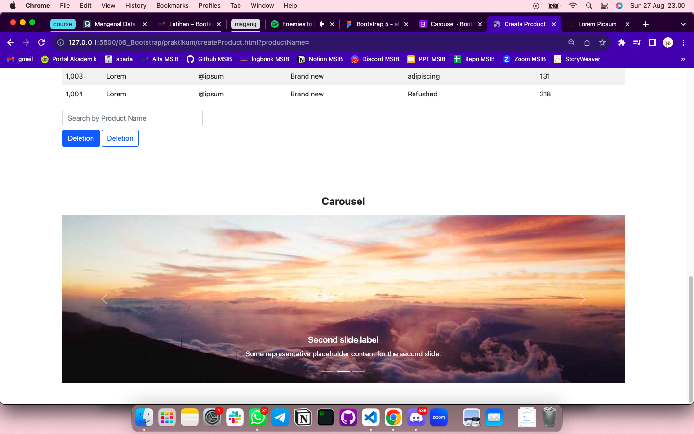

# Summary

### Definisi Bootstrap

Bootstrap adalah sebuah framework open-source yang digunakan untuk mengembangkan desain dan tampilan situs web dengan cepat. Berikut adalah beberapa poin mengenai Bootstrap:

- **Grid System**: Bootstrap menyediakan sistem grid yang dapat digunakan untuk mengatur tata letak halaman. Ini memungkinkan tampilan yang konsisten di berbagai perangkat dan ukuran layar.
- **Component UI**: Bootstrap menyediakan komponen UI siap pakai seperti button, form, navbar, footer, carousel, dll.
- **Responsive**: Bootstrap dapat membuat situs web yang responsif secara otomatis dimana tampilan situs akan disesuaikan dengan baik pada perangkat seluler dan desktop.

Bootstrap menjadi pilihan yang populer bagi pengembang web untuk mempercepat proses pengembangan dan menciptakan situs web yang menarik secara visual.

### Layout

Banyak cara yang dapat dilakukan untuk mengatur layout dalam pembuatan website. Di dalam Bootstrap terdapat component `Row` dan `Col` untuk mengatur pembagian layout seperti column. Cara yang lebih spesifik yaitu dengan mengaturnya di file CSS dengan memainkan properti `Background`.

Beberapa contoh properti `Background` di antaranya:

- background-size: mengatur ukuran,
- background-image: mengatur image sebagai bg,
- background-repeat: mengatur pengulangan,
- background-color: mengatur warna,
- background-position: mengatur posisi,
- dll.

### Responsiveness

Bootstrap memiliki sejumlah fitur responsif yang memungkinkan pengembang untuk dengan mudah menciptakan tampilan yang sesuai dengan berbagai ukuran layar dan perangkat. Berikut adalah beberapa fitur responsif kunci dalam Bootstrap:

1. Grid <br>

Sistem grid Bootstrap terdiri dari 12 kolom dan mudah digunakan untuk mengatur tata letak elemen-elemen dalam berbagai kombinasi untuk beradaptasi dengan layar yang berbeda.

2. Class <br>

Bootstrap menyediakan responsive class, contohnya `.d-none` untuk menyembunyikan elemen pada ukuran layar tertentu atau `.d-sm-block` untuk menampilkan elemen hanya pada layar kecil (small). Ini memungkinkan developer untuk mengendalikan visibilitas elemen sesuai dengan ukuran layar.

3. Navbar <br>

Ketika membuat navbar menggunakan Bootstrap maka kita dapat mengubah navbar menjadi toggler pada layar yang lebih kecil untuk meningkatkan pengalaman pengguna di perangkat mobile.

---

# Latihan

## Soal Prioritas 1

### 1. Gunakan komponent bootstrap seperti navbar untuk membuat navigation di LandingPage.html




### 2. Gunakan komponent bootstrap seperti button dan form di halaman CreateProduct.html

form

```
 <!-- FORM SECTION -->
    <section>
      <form class="row justify-content-center">
        ...
      </form>
    </section>
```

button

```
<div class="d-grid">
    <button type="submit" class="btn btn-primary">Submit</button>
</div>
```

### 3. Buatlah halaman CreateProduct.html

halaman html di convert pada link [ini.](https://cloudconvert.com/)



## Soal Prioritas 2

### 1. Gunakan grid system dari BS ketika membuat CreateProduct.html.

```
<div class="col-6">
    <h5 class="text-start fw-bold">Detail Product</h5>
    <div class="mb-4">
        <label for="productName" class="form-label">Product name</label>
        <input type="text" class="form-control" id="productName" />
    </div>
</div>
```

### 2. Buatlah halaman memiliki validasi memanfaatkan BS



## Soal Eksplorasi

Menerapkan JavaScript plugin yaitu Carousel pada halaman CreateProduct.html


