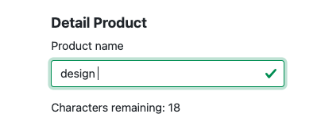
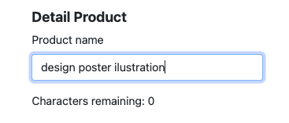
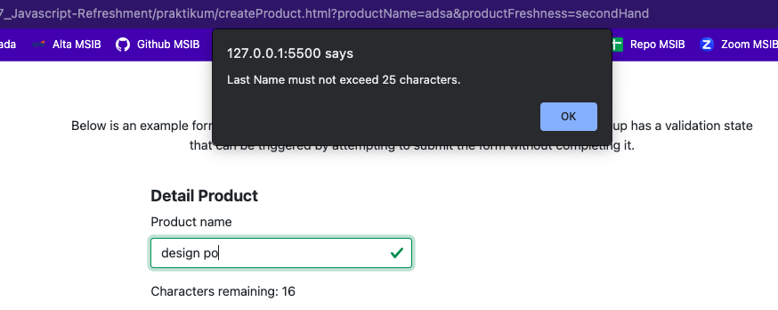
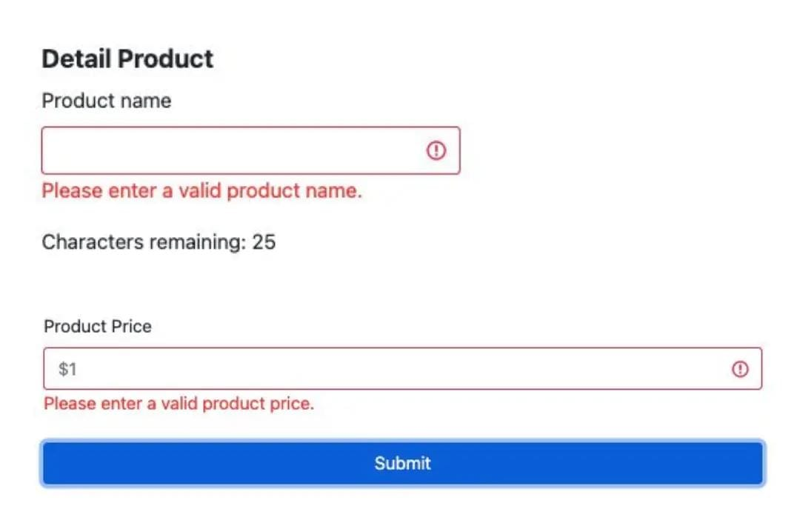
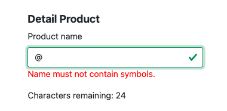
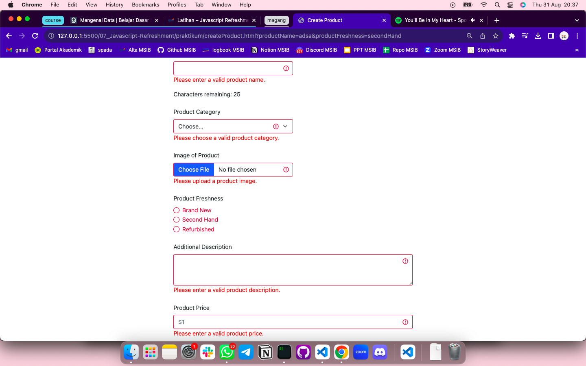
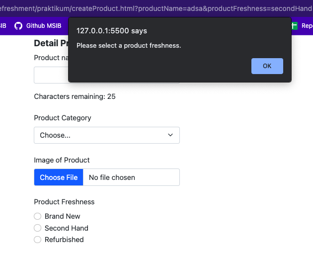
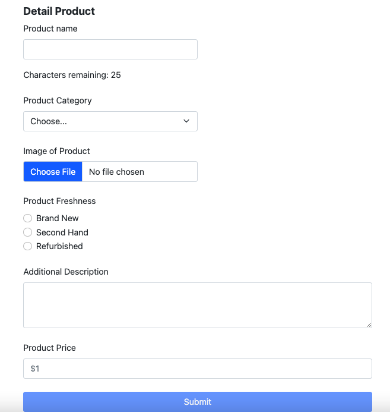
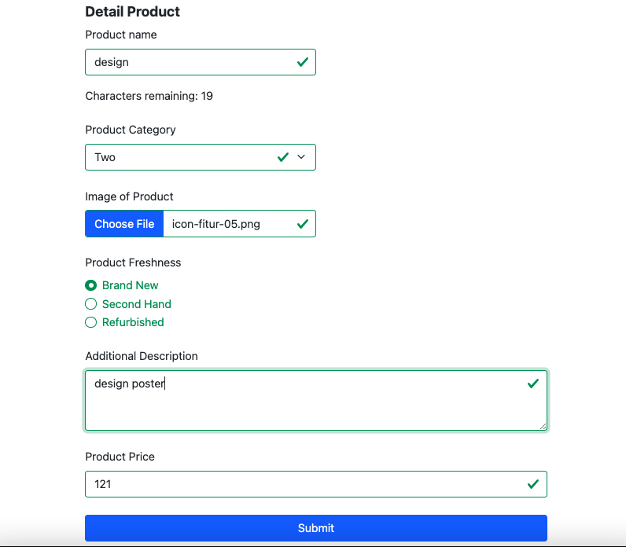

# Summary

Javascript adalah bahasa pemrograman yang memungkinkan kita untuk membuat konten dinamis dan interaktif pada website.

### Values

1. Declaration  
   Proses pembuatan variable untuk menyimpan data. Contohnya: var, let, & const.

2. Scoping  
   Menentukan dimana variable, function, dan object diatur dan dapat diakses dalam code. Contohnya: global, function/local, & block.

3. Hoisting  
   Membuat beberapa jenis variable/function dapat diakses sebelum code dideklarasikan. Contoh:
   - `var` & `func` adalah hoisted.
   - `let` & `const` tidak hoisted.

### Array

pada array jika menggunakan `const` ketika data kosong atau undefined tidak akan terjadi error.

### Spread

untuk mengambil elemen dalam array yang dapat digabung ke dalam semacam daftar. Ditandai dengan syntax `…<const>`

### Method

Sebuah function yang terkait dengan object yang bertujuan untuk menyederhanakan program. Contoh method:

- concat
- map
- foreach
- slice
- filter
- reduce

---

# Latihan

## Soal Prioritas 1

- Product Name tidak boleh melebihi 25 karakter

jumlah karakter yang tersisa dihitung pada variabel `charactersRemaining`  

jika form input text sudah mencapai 25 karakter maka tidak dapat memasukkan input lagi  

- Jika Product Name melebihi 10 karakter tambilkan pesan error atau peringatan/alert seperi "Last Name must not exceed 25 characters."

- Product Name dan Product Price tidak boleh kosong. Jika field tersebut kosong saat tombol Submit/Create Product di tekan maka tampilkan alert atau error bahwa field tersebut tidak boleh kosong. Misal "Please enter a valid Product name.".

## Soal Prioritas 2

- Product Name tidak boleh mengandung karakter seperti @/#{}

- Jika Product Name mengandung symbol @/#{} tampilkan pesan error atau peringatan misal "Name must not contain symbols."

- Validasi input setiap form bahwa field tidak boleh kosong. Jika field kosong saat form dikirim maka tampilkan pesan error “The xxx field must be filled in”

untuk bagian input radio, memiliki pesan error berupa alert

## Soal Eksplorasi

- Buatlah script DOM JavaScript untuk menonaktifkan tombol Submit/Create Accountjika salah satu input tidak valid/salah/belum di isi.

jika form sudah lengkap diisi maka bisa dikirim

