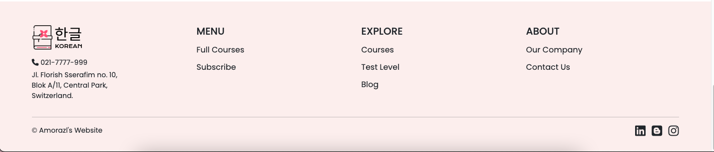
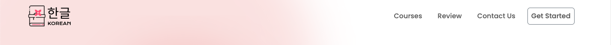
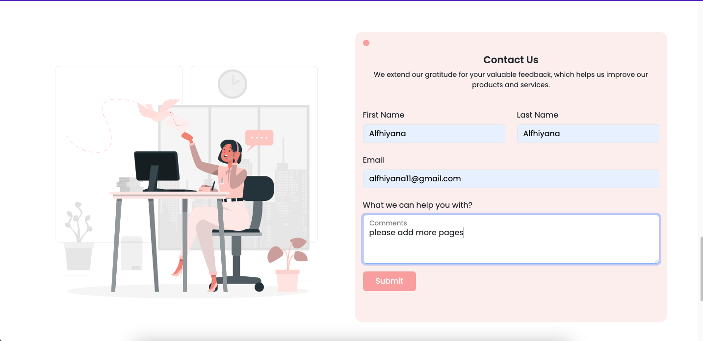
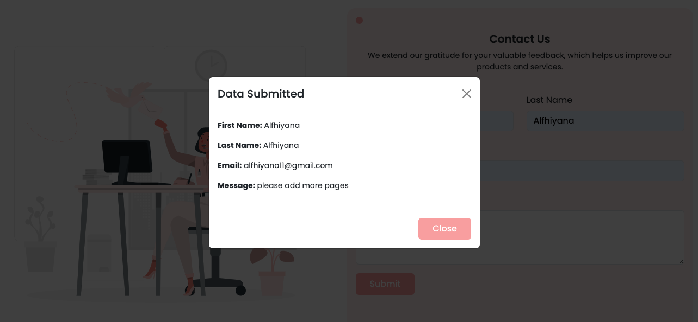

# Code Competence

### Membuat Footer

Footer tersebut memiliki beberapa komponen yaitu:

- Terdapat link sosial media kalian (minimal 3)
- Terdapat nama dari website
- Terdapat nomor telepon dan juga alamat

## Membuat Landing Page

Buatlah welcome page dan lakukan pemasangan bootstrap dengan memuat:

- Header(memiliki logo dan juga navigation bar)

- Welcome section (terdapat gambar dan kata-kata yang menarik user)

## Membuat Contact Us

Menggunakan framework bootstrap dengan kriteria dari aplikasi sebagai berikut:

- Memiliki 4 buat form(username bertime text, email bertime email, message bertipe text area)

- Memiliki button submit (jika kita menekan tombol submit maka keluar alert yang berisikan data yang kita masukkan pada form)

**Hasil Seluruh Website**

