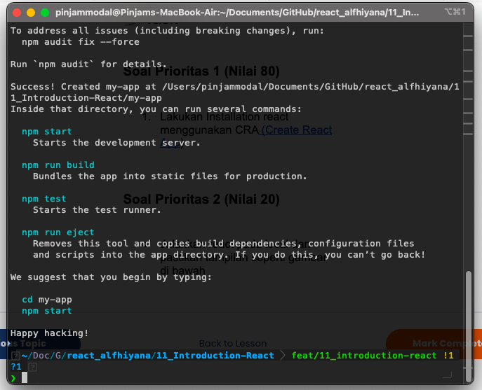
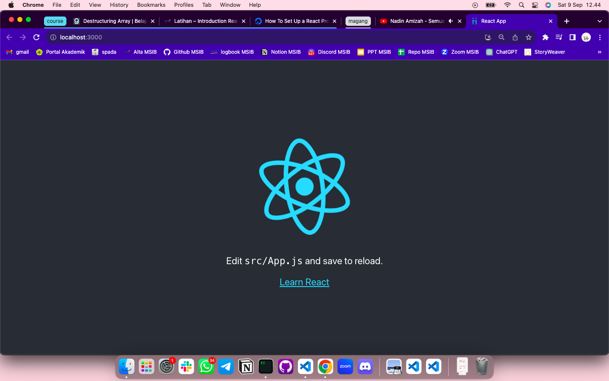
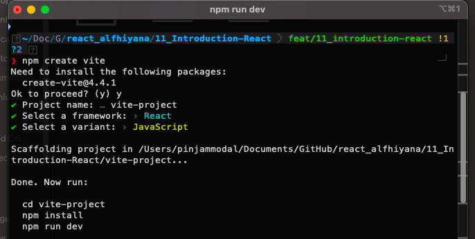
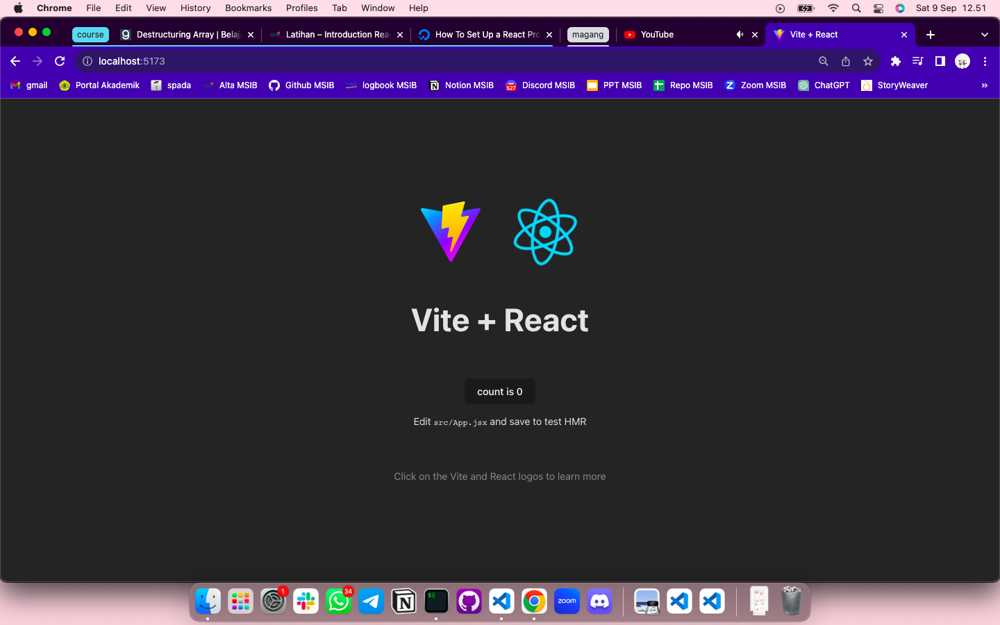

# Summary

### Library vs Framework

Library adalah sebuah tools yang membantu kita dengan menggunakan potongan kode yang sudah ada untuk melakukan tugas-tugas tertentu tanpa harus menulis semuanya dari awal.

Sedangkan sebuah framework yaitu seperti kerangka yang memberi arahan untuk membangun aplikasi web. Dalam framework, sudah ada struktur dasar dan aturan-aturan yang harus diikuti.

### Why we should use React

**React** adalah library javascript untuk membuat user interface (UI) yang interaktif dan cepat pada web maupun mobile.

Berikut adalah beberapa poin yang menjadi alasan kita memilih React untuk membuat web aplikasi:

- Deklaratif
- Berbasis komponen
- Sudah teruji oleh aplikasi besar
- Teknologi yang populer

### V-Dom

Virtual DOM adalah konsep yang digunakan dalam pemrograman web untuk membuat proses pengembangan aplikasi web menjadi lebih efisien. Dengan kata lain, merupakan representasi dari UI berbentuk javascript object yang disimpan pada memori. V-Dom memudahkan kita untuk memanipulasi Dom dengan bantuan library React-Dom.

---

# Latihan

### Soal prioritas 1

Lakukan Installation react menggunakan CRA

### Soal prioritas 2

Jalankan react pada local

### Soal eksplorasi

1. Buatlah project react menggunakan vite.

2. Jalankan pada local

