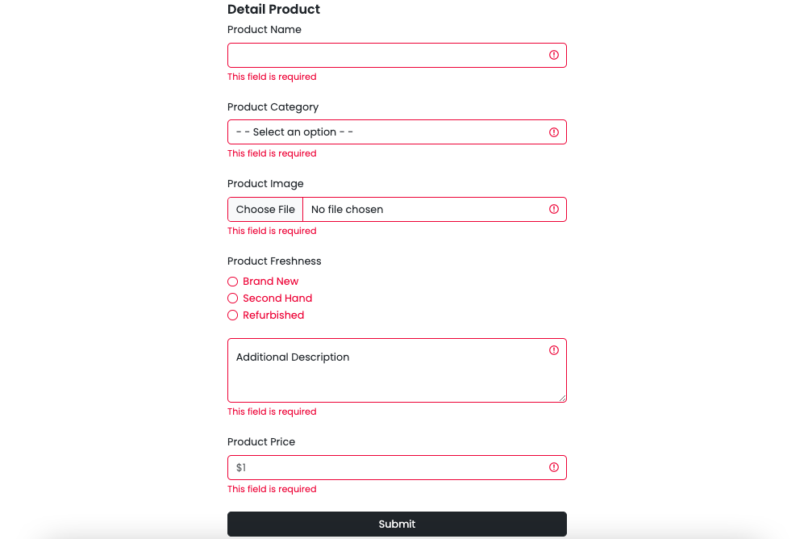
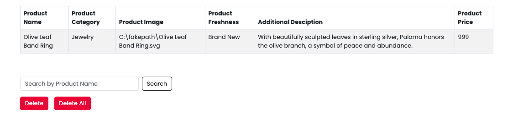
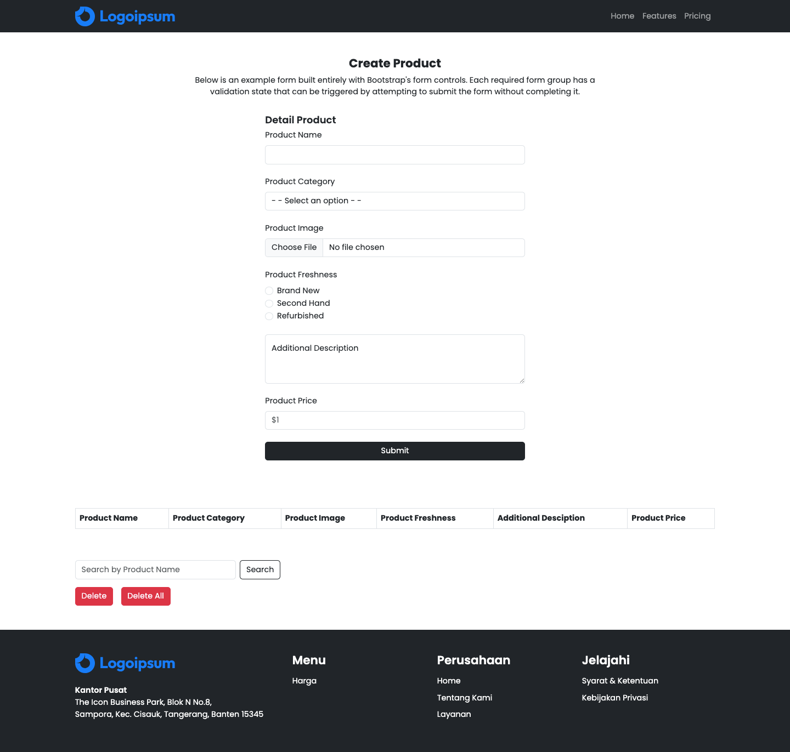

# Summary

### React Lifecycle

1. **Mounting (pemasangan)**

   terjadi ketika baru buka apk

   constructor > render > react update dom & refs > componentDidMount

2. **Updating**

   jika ada perubahan state baru akan terjadi re-render.

   new props > render > react update dom & refs > componentDidUpdate

3. **Unmounting (pelepasan)**

   componentWillUnmount

### JSX (Javascript XML)

Merupakan ekstensi pada javascript yang dimana kita dapat menggabungkan Javascript, CSS dan HTML dalam satu file. Aturan dalam React:

- Penamaan elemen yang harus diawali huruf kapital sebagai bentuk elemen yang kita buat sendiri. Jika elemen diawali huruf kecil, artinya itu merupakan elemen bawaan.

### Props (Properties)

Merupakan media untuk menyimpan value secara temporary dan dioper antar component. Props bersifat read-only, tidak dapat diubah dan dapat membantu membuat komponen menjadi lebih dinamis.

- One way data flow: hanya bisa transfer data dari parent ke child namun tidak bisa sebaliknya.

---

# Latihan

### Soal prioritas 1

- Ubahlah halaman`CreateProduct.html` dari project yang sudah anda buat menjadi komponen ReactJS.

- Gunakan `JSX (JavaScript XML)` untuk mengubah HTML kedalam ReactJS.

Seluruh fungsionalitas pada file `createProduct.html` sebelumnya sudah diubah ke dalam bentuk `createProduct.jsx`.

### Soal prioritas 2

Hubungkan CSS dan JS yang kalian gunakan pada halaman CreateProduct.html sehingga tampilan dapat bekerja dengan baik.

### Soal eksplorasi

Buatlah komponen-komponen ReactJS yang membagi halaman CreateProduct.html menjadi lebih kecil seperti header dan footer.

Komponen header dan footer untuk createProduct.jsx sudah dibagi dan disimpan pada folder components yang berisi `NavbarApp` dan `FooterApp`.
