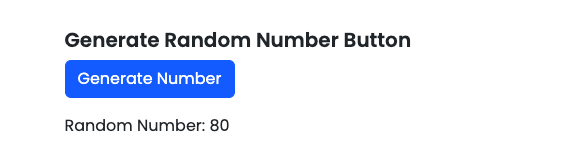
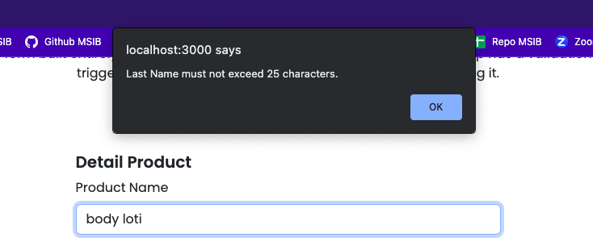
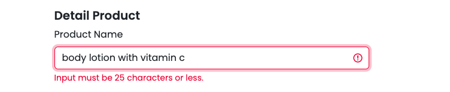
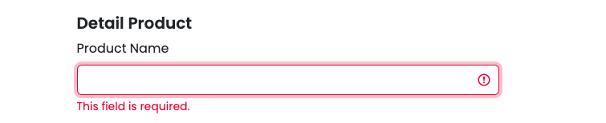
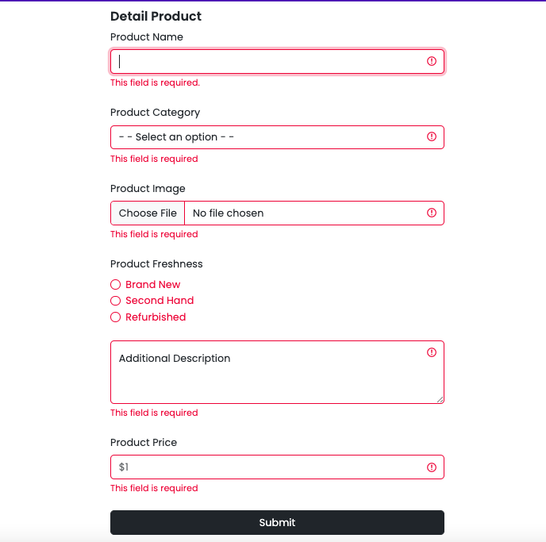
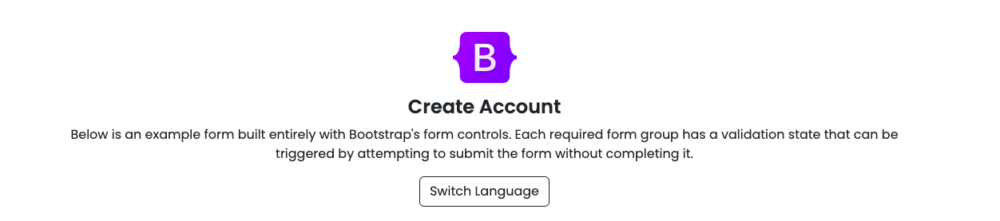

# Summary

### Definisi State

state adalah data private yang hanya bisa diakses pada sebuah komponen dan tidak bisa diakses oleh komponen lain. Data hanya dapat dimodifikasi melalui setState dan setiap terjadi modifikasi maka akan dirender ulang.

### Props vs State

Props:

- read only
- cannot be modified

State:

- dapat diubah
- dimodifikasi dengan `this.setState`

### Stateful vs Stateless

stateful artinya component yang memiliki state dan dibuat dengan class. stateless artinya tidak memiliki state hanya prop dan dibuat dengan function sehingga code yang dibuat lebih ringkas.

1. Berikut nama-nama component berdasarkan tipe statenya:

   **stateful**:

   - smart component
   - container component

   **stateless**:

   - dump component
   - presentational component

2. Perbedaan antara stateful & stateless

   **stateful:**

   - mengerti tentang aplikasi
   - melakukan fetching data
   - tujuannya berinteraksi dengan aplikasi
   - tidak dapat digunakan kembali
   - meneruskan status dan data ke children

   **stateless:**

   - tidak tahu tentang aplikasi
   - tidak melakukan fetching data
   - tujuannya untuk visualisasi
   - dapat digunakan kembali
   - hanya berinteraksi dengan induknya langsung

---

# Latihan

### Soal Prioritas 1

- Buatlah sebuah button dan terapkan event handling `onClick` pada salah satu tombol yang jika di-klik akan menampilkan random number.

```
const [randomNumber, setRandomNumber] = useState(null);
  const handleRandomNumber = () => {
    // Generates a random number between 1 and 100
    const random = Math.floor(Math.random() * 100) + 1;
    setRandomNumber(random);
  };

<Button type="button" variant="outline-primary" onClick={handleRandomNumber}>
   Generate Number
</Button>
{randomNumber !== null && <p>Random Number: {randomNumber}</p>}
```


Ketika Button di klik maka akan memunculkan random number



- buatlah sebuah file yang berisikan object article

File ada pada folder components bernama `Article.jsx`, kemudian dipanggil pada file `createProduct.jsx` sebagai komponen.

### Soal Prioritas 2

Menggunakan event handling onChange untuk validasi value secara realtime yang dimasukan kedalam form input.







### Soal Eksplorasi

- Lakukan validasi pada halaman `createProduct.jsx`



- Button untuk mengubah bahasa pada title dan description

Bahasa Inggris


Bahasa Indonesia

