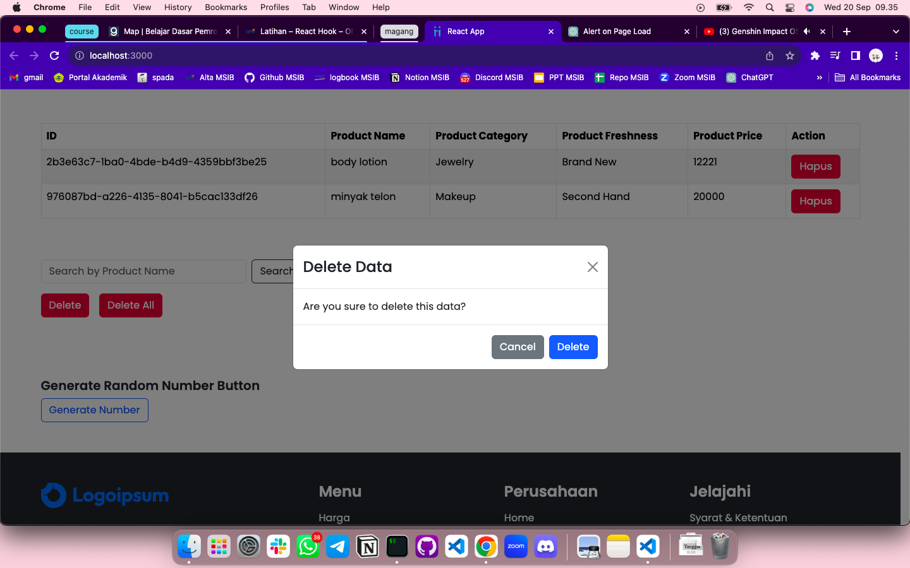
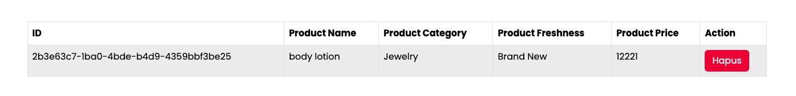

# Summary

### Definisi React Hooks

Merupakan fitur pada ReactJS yang memungkinkan developer menggunakan state dan fitur React lainnya pada komponen fungsional. Pada React Hooks kita menggunakan function component bukan class component lagi.

React Hooks memiliki aturan harus di declare sebelum return atau hanya pada tingkat atas. Tidak boleh dipanggil pada loops, conditions, maupun nested function. Memiliki banyak variable state, contohnya number, string, array of object.

### Beberapa Jenis React Hooks

**useImperativeHandle** untuk mengkombinasi 2 event atau lebih menjadi 1 function. memiliki return object.

**useMemo** untuk skip re-render yg tidak perlu untuk meningkatkan performance. hanya execute parameter yang diperlukan, dan jika ada hal lain yang bukan prioritas mengalami perubahan maka tidak akan ada re-render. useMemo digunakan pada beberapa case saja seperti kalkulasi component yang central seperti bahasa atau theme.

**re-render** terjadi karena ada perubahan pada state & props.

**clean-up** untuk menghentikan process yang sedang berjalan.

### Custom Hooks

Hooks adalah reusable function. Ketika kita memiliki logika komponen yang ingin digunakan pada beberapa komponen sekaligus, maka kita bisa memanfaatkan react hooks.

---

# Latihan

### Soal Prioritas 1

- Dengan menggunakan useEffect buatlah sebuah alert yang bertulisan “Welcome” ketika mereka membuka halaman CreateAccount.

- Dengan menggunakan UseState masukkan setiap data yang kalian isi pada halaman CreateProduct ke dalam tabel.

- Nomor dibuat random menggunakan UUID atau sejenisnya. pastikan tidak ada duplikasi nomor.

### Soal Prioritas 2

Buatlah tombol delete berfungsi, pastikan ketika ingin melakukan delete terdapat alert/modal/notifikasi yang bertuliskan apakah kalian ingin menghapus.

konfimasi jika ingin delete product

data berhasil dihapus

