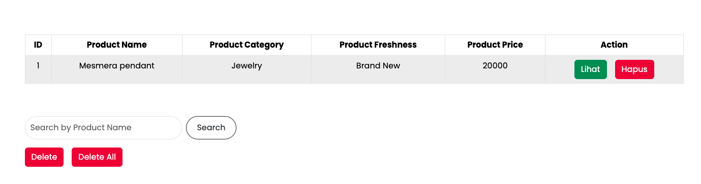
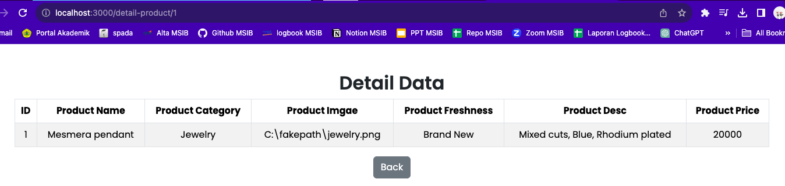

# Summary

### Definisi React Routing

Sebuah library untuk melakukan routing pada aplikasi react. Memiliki beberapa komponen di antaranya: BrowserRouter, Route, Link, dan Switch.

1. **Single Page Application**

   Hanya ada 1 halaman yang menangani semua aktivitas pada web tersebut.

2. **Multi Page Application**

   Jenis website yang perlu memuat ulang seluruh halaman web setiap kali ada request baru.

### URL Parameter

Merupakan suatu parameter yang nilainya ditetapkan secara dinamis pada URL halaman. Menggunakan syntax `this.props.match.params`

### Hook Routing React

1. useHistory: akses instance riwayat untuk bernavigasi
2. useLocation: mengembalikan lokasi url saat ini
3. useParams: mengembalikan pasangan object pada url saat ini
4. useRouteMatch: mencocokkan url tanpa tanpa merender route

---

# Latihan

### Soal Prioritas 1

- Buatlah halaman LandingPage berdasarkan LandingPage.html yang telah kalian buat pada tugas sebelumnya

- Navigasi LandingPage.jsx ke komponen CreateProduct.jsx menggunakan React Routing

LandingPage.html telah dibuat dalam bentuk LandingPage.jsx yang menghubungkan dengan CreateProduct.jsx pada navbar.

### Soal Prioritas 2

- Dengan memanfaatkan react routing buatlah fitur ketika user melakukan klik salah satu data pada tabel maka akan masuk ke halaman lain dan memunculkan data tersebut secara lengkap.

Menampilkan data dari form yang telah disubmit

Menampilkan detail product berdasarkan id product

