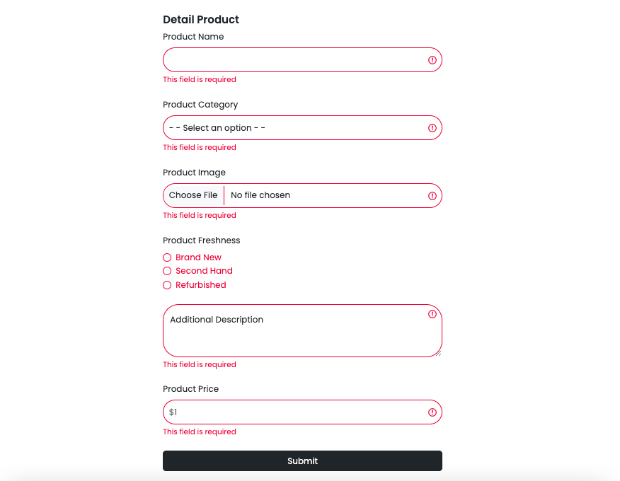
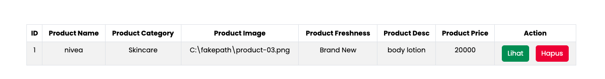
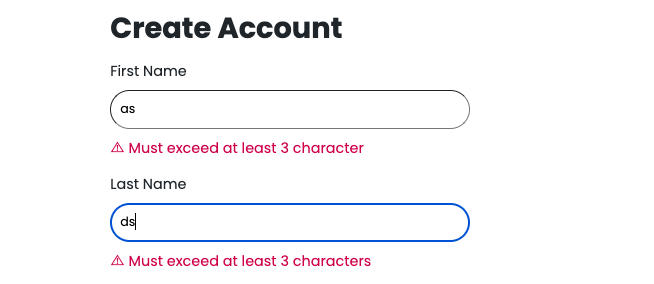
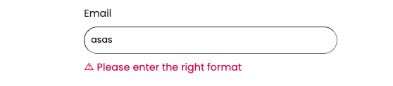
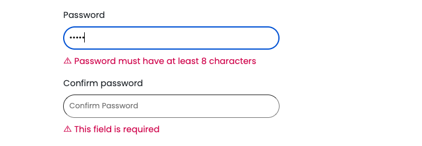
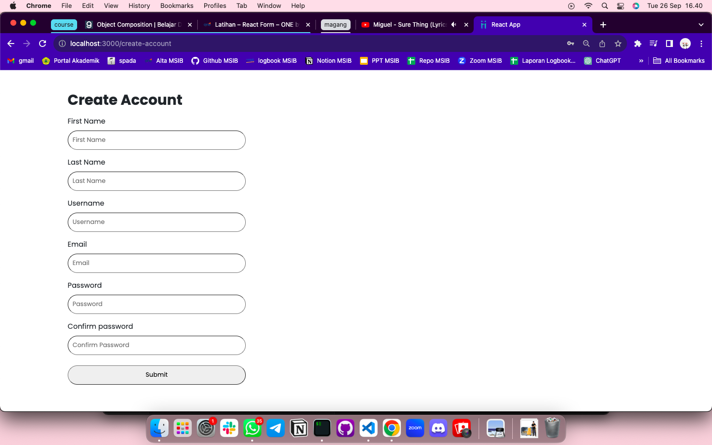

# Summary

### Definisi Form

Dalam React JS, "form" adalah elemen yang digunakan untuk mengumpulkan input data dari pengguna. Form biasanya terdiri dari berbagai elemen seperti input, select, radio, textarea, checkbox, upload file dll.

### Controlled Component

Cara menyimpan dan memperbaharui state pada komponen dengan menggunakan state. Perubahannya diatur pada event `onChange`. Kita memakai Controlled component ketika form butuh melakukan validasi maupun memiliki rules tertentu. Beberapa kekurangan menggunakan controlled component:

- ketika state berubah, akan selalu melakukan re-render
- maintain dengan native approach (sulit di maintain)

### Uncontrolled Component

Uncontrolled component form dalam React adalah jenis form di mana data input tidak dikendalikan oleh React state. Dimana kita tidak menyimpan atau mengelola input dengan state melainkan menggunakan DOM (ref). Keuntungan menggunakan uncontrolled component yaitu lebih sederhana dan dapat digunakan untuk mengambil input secara umum tanpa rules.

---

# Latihan

### Soal Prioritas 1

regex validasi pada product name, product category, product freshness, product price yang telah kalian buat pada halaman CreateProduct

### Soal Prioritas 2

- Buatlah form image dan Product Freshness dapat berfungsi dan ketika user menggunakan form tersebut. datanya akan masuk ke dalam tabel.

- Buatlah validasi untuk Image dan Product Freshness sehingga data yang di masukkan valid.

### Soal Eksplorasi

Membuat form registrasi pengguna menggunakan React-Hook-Form dan memiliki validasi seperti berikut:

- First name dan last name harus memiliki panjang minimal 3 karakter.

- Email harus memiliki format email yang valid.

- Password harus memiliki panjang minimal 8 karakter dan harus cocok dengan confirm password.

Bentuk form secara keseluruhan

