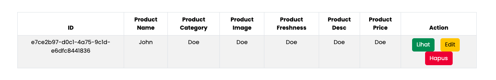
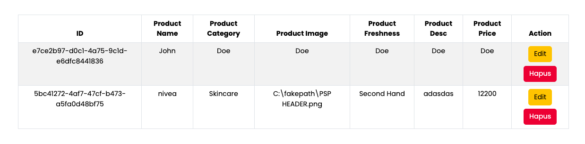
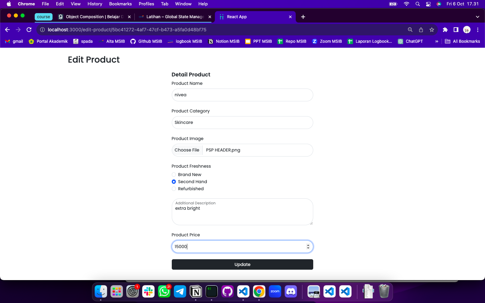
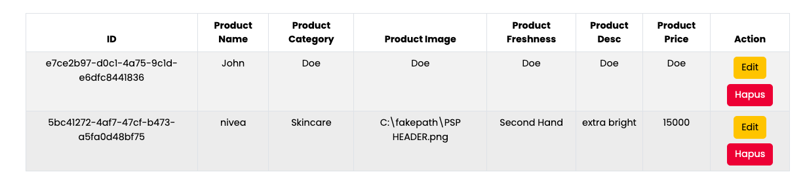
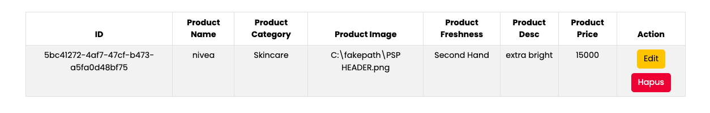

# Summary

### Definisi Redux

Redux adalah library JavaScript yang digunakan untuk mengelola dan menyimpan data untuk memudahkan pengelolaan state agar lebih terstruktur dan mudah dipahami.

### Kapan Redux Digunakan

Beberapa kondisi yang tepat untuk menggunakan redux, di antaranya:

1. Ketika banyak state yang harus ditaruh di banyak tempat
2. State pada app sering berubah
3. Logic untuk menggunakan state terbilang kompleks
4. Ukuran codebase besar yang dikerjakan banyak developer
5. Ketika perlu mengetahui bagaimana state di update seiring waktu

### Komponen Pada Redux

1. **Action**
   Digunakan untuk memberikan informasi dari aplikasi ke state. Salah satunya yaitu **Payload** yang digunakan untuk menyimpan data yang akan dikirim dan dapat berisi object, string, number, dll.

2. **Reducer**
   Pure javascript function yang mengambil state saat ini lalu mengembalikan state aplikasi terbaru.

3. **Store**
   Object central yang menyimpan state pada aplikasi.

---

# Latihan

### Soal Prioritas 1

- Rubahlah list products yang sebelumnya berupa state biasa menjadi global state menggunakan redux.

list product sudah menggunakan global state redux yang terdapat pada file `productSlice.js` dan `store.js`

- Masukkan data user ke dalam Initial state

membuat inisial state pada table list

```
const initialState = [
  {
    id: "e7ce2b97-d0c1-4a75-9c1d-e6dfc8441836",
    productName: "John",
    productCategory: "Doe",
    productImage: "Doe",
    productFreshness: "Doe",
    productDesc: "Doe",
    productPrice: "Doe",
  },
];
```

- Pastikan data List Product (ilustrasi pada gambar) berasal dari initialState pada store.



### Soal Prioritas 2

Tambahkan fitur untuk menambah, mengedit, dan menghapus data user dalam komponen ListProduct.jsx dengan menggunakan action dan reducer yang sesuai.

- Menambahkan product dengan mengisi form yang terletak di atasnya



- Mengedit product



product yang sudah diedit


- Menghapus Product


