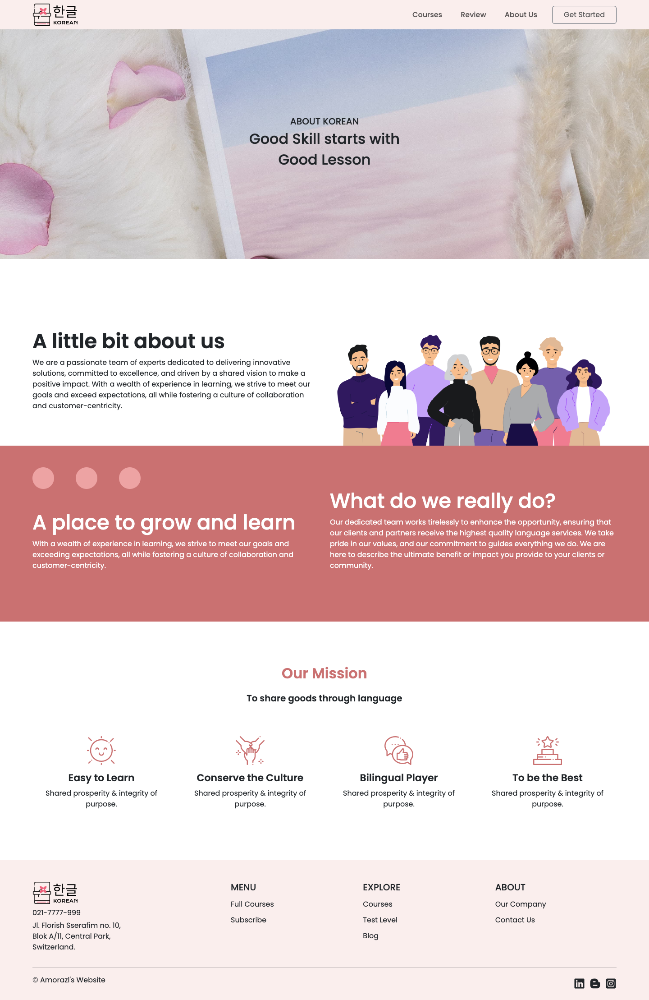
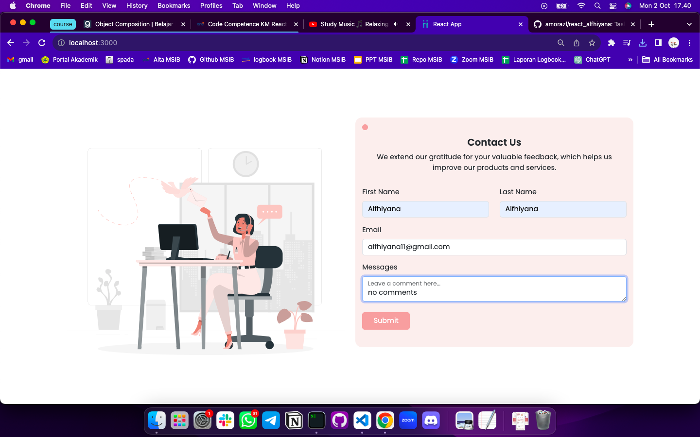
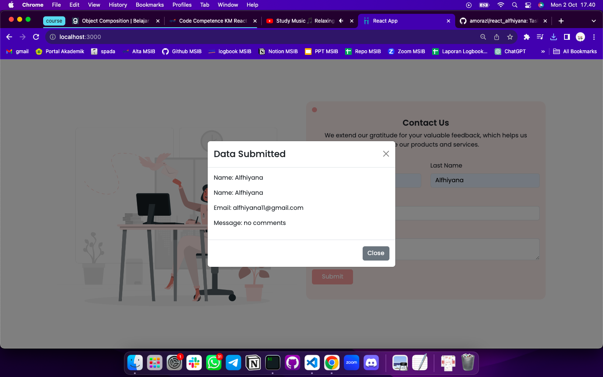

# Summary

- Ubah lah kode yang kalian tulis pada weekly task 1 ke dalam react

Hasil Landing Page

Hasil About Us yang dapat diakses pada navbar

- Buatlah berfungsi component contact us kalian buat, sehingga ketika setiap form diisi dan button submit di klik akan memunculkan alert/modal yang berisikan data yang kalian masukkan ke dalam form

Memasukkan data ke dalam form

Hasil data yang muncul pada modal

