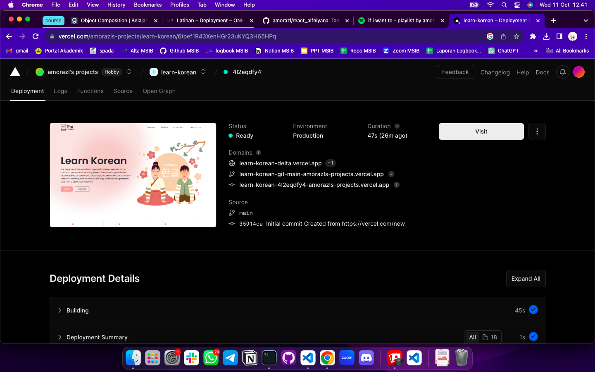

# Summary

### Build

Tujuan melakukan build adalah agar aplikasi yang kita buat ada pada versi production sehingga memiliki performa yang lebih cepat. Selain itu, build dapat membantu mengoptimalkan dan mengurangi aplikasi, melakukan testing, serta memisahkan antara bagian production dan development. Build merupakan langkah kunci dalam siklus pengembangan perangkat lunak yang membantu memastikan bahwa aplikasi siap untuk dijalankan di lingkungan produksi dengan aman dan efisien.

### Deployment

Kegiatan untuk menyebarkan aplikasi yang sudah dibuat agar dapat diakses secara publik. Contoh layanan untuk melakukan deployment yaitu: surge, netlify, vercell, dll.

### Hal yang perlu diperhatikan dalam Deployment

Untuk memastikan proses berjalan lancar dan aplikasi dapat berjalan dengan baik, berikut hal-hal yang harus diperhatikan:

- Pemilihan lingkungan produksi
- Backup data
- Monitoring & logging
- Skalabilitas & pembaharuan berkala
- Keamanan

---

# Latihan

Pilih repository yang telah kalian push kode aplikasi ke dalamnya di Vercel, kemudian ikuti langkah-langkah untuk mendeploy aplikasi ReactJS ke Vercel.

> Deployment berhasil dilakukan dengan memilih tugas code competence 2 untuk di deploy

[Link Website](https://learn-korean-4l2eqdfy4-amorazls-projects.vercel.app/)
