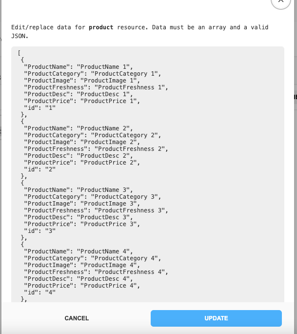
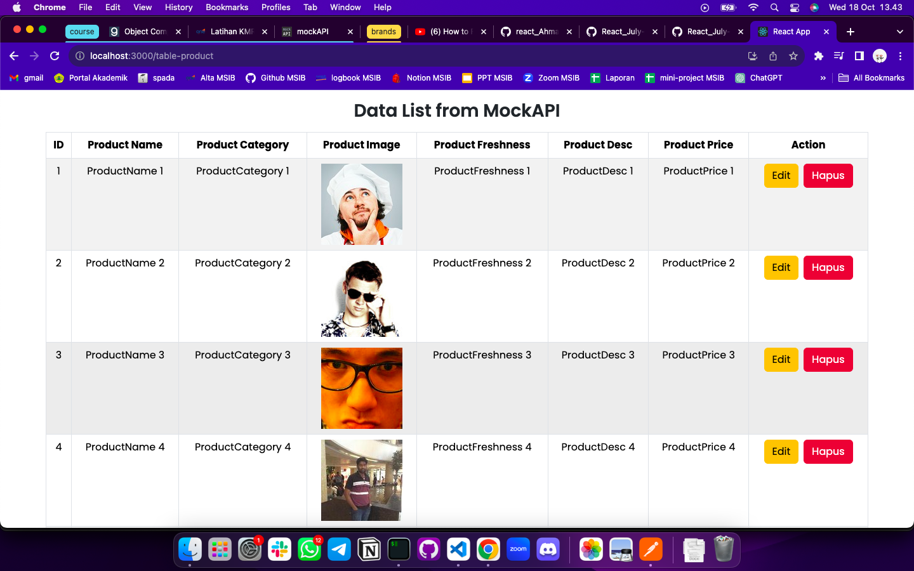

# Summary

### Restful API

RESTful API (Representational State Transfer Application Programming Interface) adalah metode komunikasi yang digunakan dalam pengembangan perangkat lunak untuk mengizinkan aplikasi berinteraksi satu sama lain melalui permintaan HTTP. Dibuat dengan tujuan agar aplikasi dapat dijalankan pada multi platform dengan berbagai bentuk frontend hanya dengan satu backend.

### API Tools

Berikut beberapa testing tools untuk melakukan testing pada sebuah API. Contohnya Katalon, Apache JMeter, Postman & SoapUI. Dengan menggunakan tools ini kita dapat melakukan transfer data, komunikasi antar aplikasi, mengakses sumber daya dan mendukung penerapan multi platform.

Adapun tool yang direkomendasikan yaitu Postman.. Postman merupakan sebuah HTTP client untuk melakukan testing pada web service yang memungkinkan kita untuk melakukan testing, development dan dokumentasi dengan mudah dan cepat.

### Open API

Merupakan API yang dapat diakses secara publik. Contohnya:

- Chronicling America
- Currents
- Reedbin
- Feedster
- New York Times, dll.

---

# Latihan

### Soal Introduction Restfull API

Buat endpoint baru di MockAPI dengan skema product memiliki field yang sama seperti form input CreateProduct.jsx

Gunakan axios untuk mengambil data dari endpoint MockAPI dan tampilkan daftar user tersebut di komponen/halaman ListProduct.jsx yang sudah anda buat untuk menampilkan List Account.

