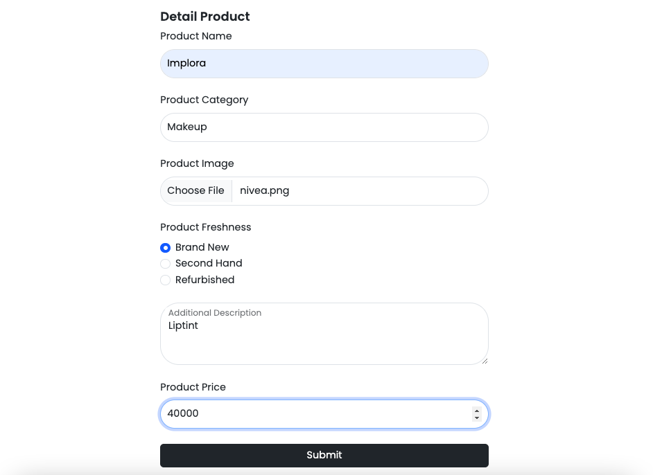
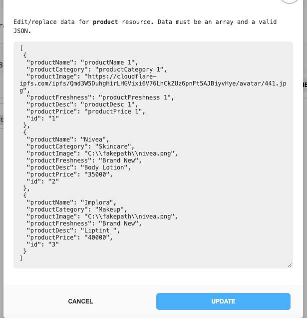
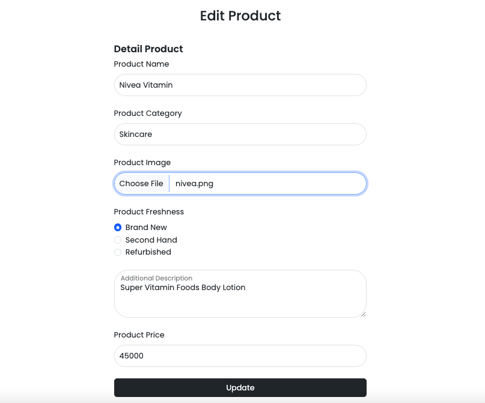
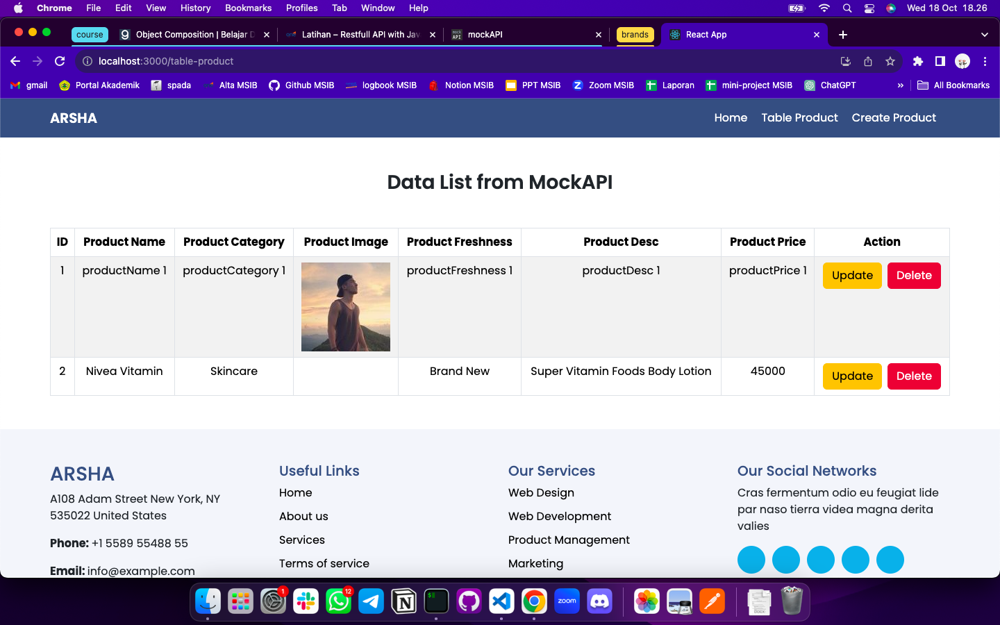
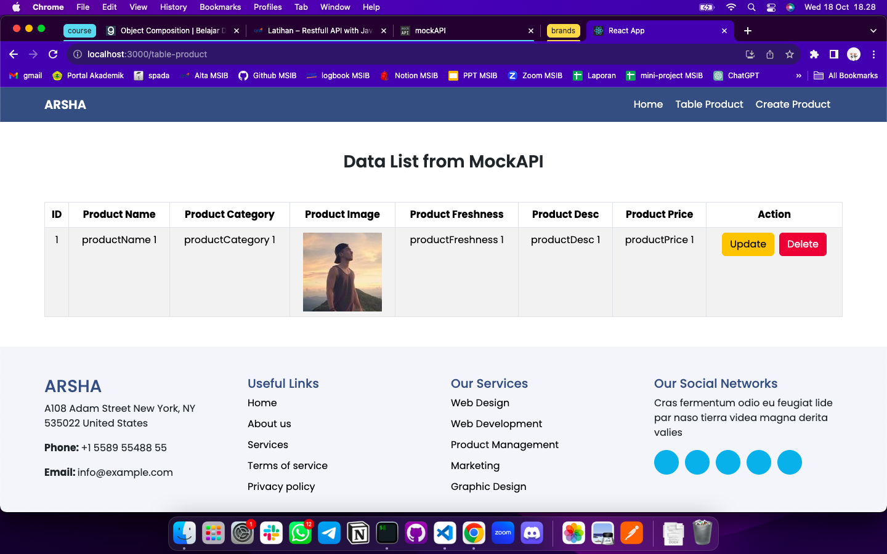

# Summary

### Mock API

Mock API adalah replika dari API yang sebenarnya, digunakan untuk pengembangan dan pengujian aplikasi tanpa perlu mengakses sumber daya API asli. Fungsinya untuk digunakan dalam pengembangan perangkat lunak untuk mengisolasi komponen, menguji integrasi, dan memungkinkan tim pengembang bekerja secara independen saat API yang sesungguhnya belum tersedia atau masih dalam proses pengembangan.

### Manfaat Mock API

Untuk mendapatkan API kita bisa menggunakan open API untuk mendapatkan dummy data sebagai contoh dari endpoint. Tujuannya agar mendapat gambaran untuk mengimplementasikannya pada frontend.

Beberapa manfaat lain yaitu:

- frontend (developing test) & backend (APIs) dapat bekerja bersamaan
- feedback loop dan menemukan issue dapat dilakukan dengan cepat

### Fitur-fitur

Kita dapat melakukan berbagai hal yang berguna dalam pengembangan perangkat lunak, termasuk:

- Pengujian
- Pelatihan dan Demonstrasi
- Prototipe Cepat

---

# Latihan

### Soal Restfull API

**1. Method POST**

Code:

```
axios
    .post("https://652f67620b8d8ddac0b2710c.mockapi.io/product", formData)
    .then((res) => console.log(res))
    .catch((err) => console.log(err));
```

Mengisi form data



Data masuk ke dalam mockAPI melalui method POST



**2. Method PUT**

Code:

```
const handleUpdate = (e) => {
    e.preventDefault();

    axios
        .put(`https://652f67620b8d8ddac0b2710c.mockapi.io/product/${id}`, product)
        .then((res) => {
        console.log("Product updated:", res.data);
        navigate("/table-product");
        })
        .catch((err) => console.log(err));
    };
```

Sebelum di edit:


Proses edit data:



Setelah di edit:



**3. Method DELETE**

Code:

```
const deleteProduct = (id) => {
    axios
        .delete(`https://652f67620b8d8ddac0b2710c.mockapi.io/product/${id}`)
        .then(() => {
        setProducts((prevProducts) => prevProducts.filter((product) => product.id !== id));
        })
        .catch((err) => console.log(err));
    };
```

Product berhasil dihapus


