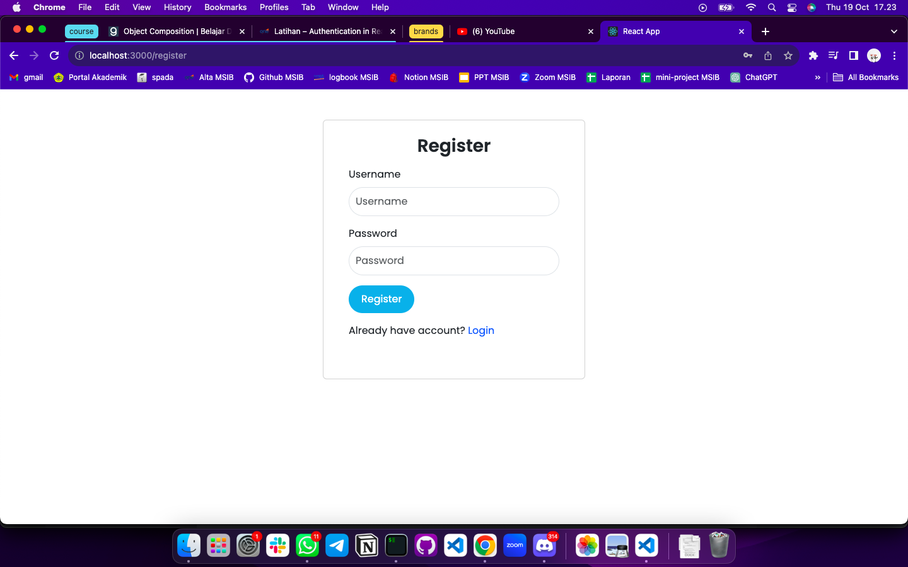
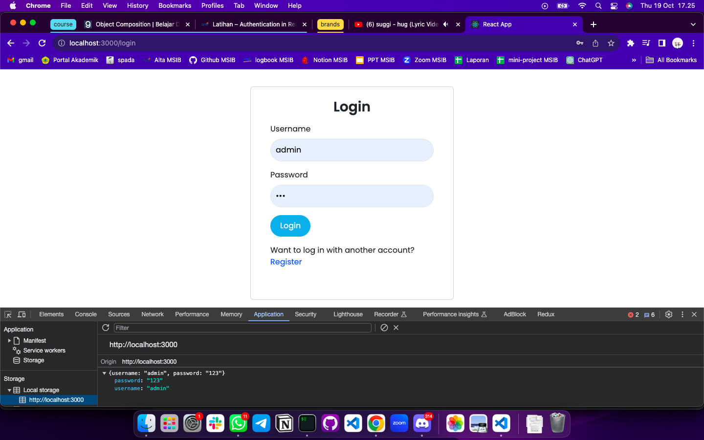

# Summary

### Authentication

Tujuan autentikasi adalah untuk memberikan akses kepada user yang tepat untuk mendapatkan resource yang sesuai. Dengan kata lain untuk mengatur keamanan routing dan izin pada aplikasi.

### Login

Merupakan proses bagi user untuk mendapatkan akses pada komputer sistem dengan mengidentifikasi user tersebut melalui proses mengisi informasi-informasi tertentu yang dibutuhkan seperti username atau email dan password. Pada bagian frontend bertugas untuk membuat tampilan interface yang menarik dan berfungsi dengan baik. Sedangkan bagian backend bertugas untuk mengamankan data dan proses verifikasi yang berlangsung.

### API Interceptor

API Interceptor adalah komponen atau fungsi yang digunakan untuk menangani permintaan HTTP atau API secara terpusat sebelum permintaan tersebut dikirim ke server atau setelah menerima respons dari server.

Beberapa fungsi utama API Interceptor:

- autentikasi
- manipulasi data
- error handling
- logging & caching

---

# Latihan

Buatlah Authentication dan Authorization dari project yang telah kalian buat sebelumnya. manfaatkan data dummy pada local storage untuk proses tersebut.

User harus register terlebih dahulu untuk masuk ke website tersebut.

Setelah berhasil register, user memasukkan data kembali untuk login.

Proses login berhasil maka user akan diarahkan ke halaman landing page.

Terdapat juga tombol Logout di Navbar, jika ditekan maka akan kembali diarahkan ke halaman Login.
