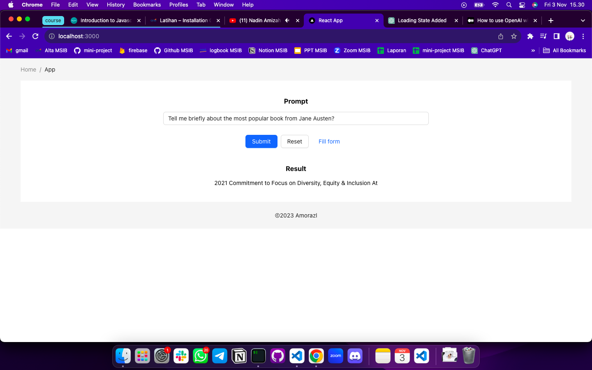

# Summary

### Why Using Open AI

Open AI gratis untuk dimanfaatkan, mudah dipasang dan digunakan pada framework kita karena hanya memerlukan API keys. Selain itu Open AI banyak dipakai dan cakupannya cukup besar.

### Installation

Cara penginstalasian Open AI pada React yaitu dengan syntax `npm i openai.` Pastikan sudah mendaftar di OpenAI dan memiliki akses ke API mereka. Kemudian kita akan mendapatkan API key yang diperlukan untuk mengakses layanan mereka. Setelah itu import module yang dibutuhkan dan copy API keys pada project React tersebut.

### Hal yang harus diperhatikan

- Autentikasi API

Pastikan untuk mengautentikasi permintaan ke OpenAI API dengan menggunakan kunci API yang valid. Hal ini dapat dilakukan melalui penggunaan token API yang diberikan oleh OpenAI.

- Handling Respons

Setelah menerima respons dari API, kita dapat mengolahnya dalam komponen React dengan menampilkan teks maupun gambar yang dihasilkan dan mengintegrasikannya dengan fungsi-fungsi lain dalam aplikasi.

- Pengujian dan Maintaning

Pastikan untuk menguji dan memelihara komponen React yang berhubungan dengan OpenAI untuk memastikan bahwa semuanya berjalan dengan baik dan sesuai dengan kebutuhan aplikasi.

---

# Latihan

Berikut hasil percobaan menggunakan 2 model Open AI yang berbeda:

> Hasil yang didapatkan dari model text-davinci-003 tidak menjabarkan jawaban yang diharapkan.

> Sedangkan ketika menggunakan model gpt-3.5-turbo, response yang didapatkan lebih maksimal dan menjawab pertanyaan dengan cukup baik.

Fitur tambahan yang dapat memudahkan user yaitu "fill form" untuk melakukan test tanpa harus mengetik secara manual pada prompt.
