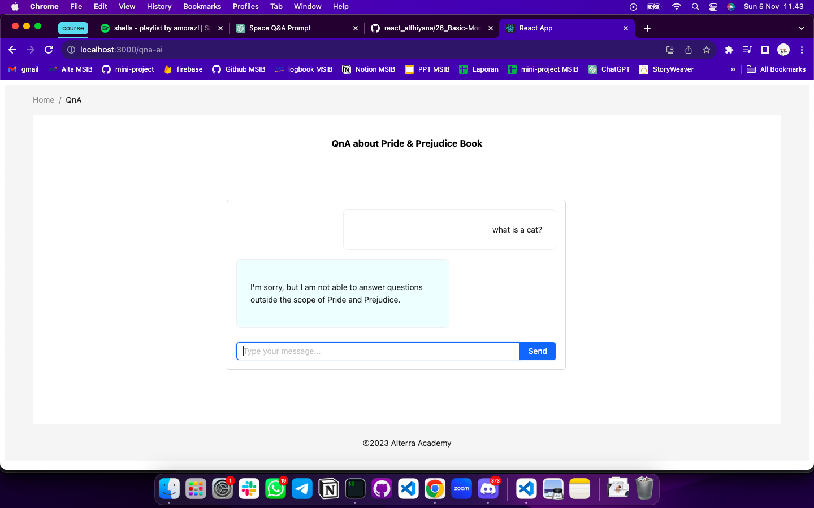

# Summary

### Benefit of Learning Open AI

Dengan mempelajari model dan prompt kita dapat mendapatkan keuntungan di antaranya:

- Meningkatkan penggunaan model Open AI
- Mengoptimalkan output model AI
- Membangun aplikasi AI yang lebih relevan
- Meningkatkan daya saing di bidang AI sehingga dapat membantu perkembangan AI

### Model OpenAI

Sebuah kecerdasan buatan AI yang memperlajari pola-pola dari data sehingga menghasilkan output sesuai dengan masukan-masukan yang diberikan. OpenAI memiliki beberapa versi, contohnya:

- GPT 4 (NLP generasi baru yang memiliki 10 triliun parameter)
- GPT 3-5 (Memiliki 6 miliar parameter, dapat menyelesaikan masalah code & matematika)
- Dall-E (model pembangkit gambar generatif dengan 12 miliar parameter)

### Prompt Engineer

Teknik untuk mengoptimalkan output dengan memberikan prompt atau instruksi pada model tersebut. Ketika menggunakan SEO kita dapat memberikan intruksi yang bebas tanpa batasan, namun jika pada prompt kita harus memberi batasan dan instruksi yang lebih spesifik.

---

# Latihan

> Berikut tampilan Home untuk memilih fitur yang akan digunakan.

> Ini adalah tampilan QnA dimana user memberikan pertanyaan di luar tema yang telah ditentukan.

> Berikut ini adalah contoh respon API terhadap pertanyaan yang sesuai konteks.

> Fitur kedua yang dapat menghasilkan random quote ketika user menekan Button `generate`

